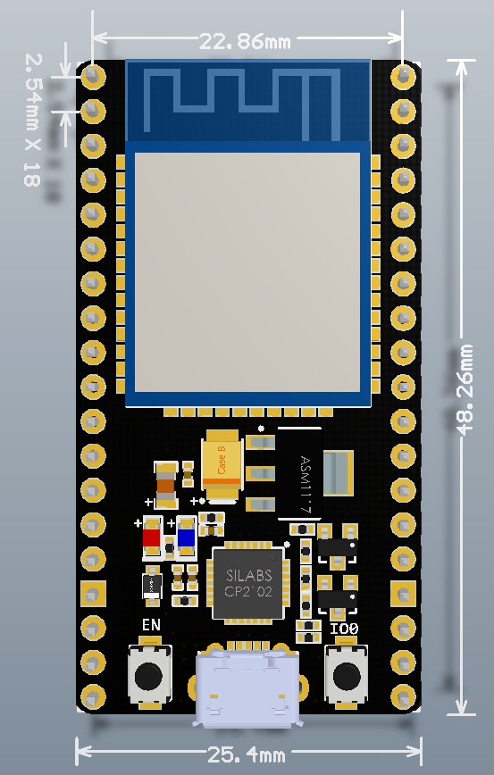

# **HOME-32**

## **TIPS**

### **INSTALL driver _NodeMCU-32S_**

#### _macOS 10.13_

* download

  >[link driver](https://www.silabs.com/products/development-tools/software/usb-to-uart-bridge-vcp-drivers)

* install

  1. montare l'immagine appena scaricata ed eseguire il package.
  2. da System Preference -> Security & Privacy - autorizzare il caricamento del modulo esterno
  3. riavviare

* caricamento manuale del modulo kernel

  ad ogni riavvio è necessario ricaricare manualmente il modulo del kernel
  per creare la periferica in /dev/cu.*

  >kextstat | grep silabs
  >
  >sudo kextload -b com.silabs.driver.CP210xVCPDriver
  >
  >kextstat | grep silabs
  >
  >ls /dev/cu*

### **PINOUT**


### **DIMENSION**



### **ADC Linear**

``` arduino

int n = 0;

void setup()
{
    Serial.begin(115200);
    analogSetWidth(10);                           // 10Bit resolution
    analogSetAttenuation((adc_attenuation_t)2);   // -6dB range
}

void loop()    //ADC Test
{
    int av = analogRead(2);                       // ADC12 on GPIO2
    for(n=1; n<8; n++) av += analogRead(2);
    av /= 8;
    Serial.print(" ADC12 = ");
    Serial.println(av,DEC);
    delay(200);
}
```