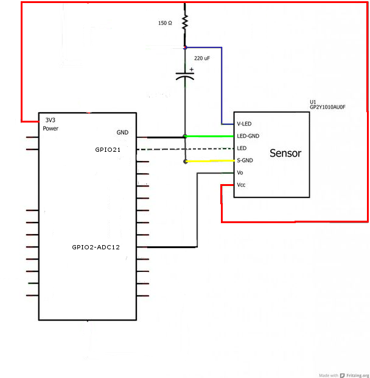
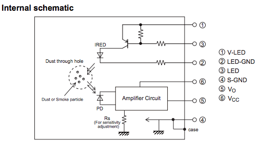

# **NODE32_01 Dust Sensor**

Aduino IDE schema for operating SHARP GP2Y1010AU0F dust sensor in NodeMCU-32S

# Credits and license

- License MIT
- nara256/GP2Y1010_DustSensor https://github.com/nara256/GP2Y1010_DustSensor

# How to use

* Include library GP2Y1010_DustSensor to your Arduino IDE.
* Wiring GP2Y1010AU0F sensor to your NodeMCU-32S.

    From left side

    | sensore | color wire | name sensor pin | direction  | name NodeMCU-32S pin | connection note |
    | ------------ | ---------- | ---- |--------------- | -------------------- | --------------- |
    | GP2Y1010AU0F | blue wire   | V-LED | < | 3.3V | via 150 ohm register, and Arduino GND via 220uF Capacitor|
    | GP2Y1010AU0F | green wire  | LED-GND | = | GND | |
    | GP2Y1010AU0F | white wire  | LED | < | Digital pin | |
    | GP2Y1010AU0F | yellow wire | S-GND | = | GND | |
    | GP2Y1010AU0F | black wire  | Vo | > | Analog pin | |
    | GP2Y1010AU0F | red wire    | Vcc | < | 3.3V | |

    warning:
    - ESP-WROOM-02(esp8266) analog(TOUT) pin support under 1V , you must make 1V from 5V or 3.3V  using a voltage divider.  
    - you must blue/red wires(Vin) and black wire(Analog out) are wiring same voltage pins. (DO not wire 5V input and 3.3V outout.)  
    - ESP32 ADC GPIOs support under 3.3V. so, it's easy to blue/red wires(Vin) wiring to 3.3V output, and black wire(analog out) wiring to ADC GPIO.

* Schema ESP32S

  

* Sensor internal schema

  

* Read sample source code. It's very simple !

# caution

* this library DOES NOT support GP2Y101**4**AU0F dust sensor.

# GP2Y1010_DustSensor library function

## Constractor

* GP2Y1010_DustSensor  
  normal constractor. if you use this constractor, you must execute begin() function after this constractor execute.

* GP2Y1010_DustSensor(int ledPin, int measurePin)  
  setting pins, and initialize sensor.  
    ledPin: set white wire digital pin no.  
    measurePin: set black wire analog pin no.  

## public function

* void begin(int ledPin, int measurePin)  
  setting pins, and initialize sensor.  
    ledPin: set white wire digital pin no.  
    measurePin: set black wire analog pin no.  

* void setADCbit(int bit)  
  set ADC bit digit.  
  ESP-WROOM-02(esp8266) and AVR Arduino platform are 10bit, ESP-WROOM-32(ESP32) is 12bit.  
  default value is 10(bit).
  
* int  getADCbit()  
  get established ADC bit digit.
  
* void setInputVolts(float volts)  
  set input voltage (5V or 3.3V).  
  if you set input voltage to 5V, Analog output voltage is 5V, too.  
  if you get analog voltage to 3,3V, you set input voltage to 5V, or 5V to 3.3V using a voltage divider.   
  default value is 5(V).
  
* float getInputVolts()  
  get established input voltage value.

* float getDustDensity()  
  get dust density (the unit is ug/m3)

# ADC2 channel cannot be used when WiFi is in use

ADC2 is used with WiFi. Therefor **`analogRead()`** on ADC2 pins fails.    
ADC1 channels are save to use => GPIO32, 33, 34, 35, 36, 39.

This list is an extract of the ESP-WROOM-32 pin definition ([Source](https://www.espressif.com/sites/default/files/documentation/esp32_hardware_design_guidelines_en.pdf)) and might help to find ADC1 and ADC2 pins:    

| Name | Function |
|:-------------:| ------------- |
| _**SENSOR_VP**_ | GPIO36, SENSOR_VP, ADC_H, _**ADC1_CH0**_, RTC_GPIO0 |
| _**SENSOR_VN**_ | GPIO39, SENSOR_VN, _**ADC1_CH3**_, ADC_H, RTC_GPIO3 |
| _**IO34**_      | GPIO34, _**ADC1_CH6**_, RTC_GPIO4 |
| _**IO35**_      | GPIO35, _**ADC1_CH7**_, RTC_GPIO5 |
| _**IO32**_      | GPIO32, XTAL_32K_P (32.768 kHz crystal oscillator input), _**ADC1_CH4**_, TOUCH9, RTC_GPIO9 |
| _**IO33**_      | GPIO33, XTAL_32K_N (32.768 kHz crystal oscillator output), _**ADC1_CH5**_, TOUCH8, RTC_GPIO8 |
| _**IO25**_      | GPIO25, DAC_1, _**ADC2_CH8**_, RTC_GPIO6, EMAC_RXD0 |
| _**IO26**_      | GPIO26, DAC_2, _**ADC2_CH9**_, RTC_GPIO7, EMAC_RXD1 |
| _**IO27**_      | GPIO27, _**ADC2_CH7**_, TOUCH7, RTC_GPIO17, EMAC_RX_DV |
| _**IO14**_      | GPIO14, _**ADC2_CH6**_, TOUCH6, RTC_GPIO16, MTMS, HSPICLK, HS2_CLK, SD_CLK, EMAC_TXD2 |
| _**IO12**_      | GPIO12, _**ADC2_CH5**_, TOUCH5, RTC_GPIO15, MTDI, HSPIQ, HS2_DATA2, SD_DATA2, EMAC_TXD3 |
| _**IO13**_      | GPIO13, _**ADC2_CH4**_, TOUCH4, RTC_GPIO14, MTCK, HSPID, HS2_DATA3, SD_DATA3, EMAC_RX_ER |
| _**IO15**_      | GPIO15, _**ADC2_CH3**_, TOUCH3, MTDO, HSPICS0, RTC_GPIO13, HS2_CMD, SD_CMD, EMAC_RXD3 |
| _**IO2**_       | GPIO2, _**ADC2_CH2**_, TOUCH2, RTC_GPIO12, HSPIWP, HS2_DATA0, SD_DATA0 |
| _**IO0**_       | GPIO0, _**ADC2_CH1**_, TOUCH1, RTC_GPIO11, CLK_OUT1, EMAC_TX_CLK |
| _**IO4**_       | GPIO4, _**ADC2_CH0**_, TOUCH0, RTC_GPIO10, HSPIHD, HS2_DATA1, SD_DATA1, EMAC_TX_ER |

# link
* GP2Y1010AU0F Data sheet  
  http://www.sharp-world.com/products/device-china/lineup/data/pdf/datasheet/gp2y1010au_e.pdf (English)  
  http://www.sharp.co.jp/products/device/doc/opto/gp2y1010au_j.pdf (Japanese)

* GP2Y1010AU0F Application note  
  http://www.sharp-world.com/products/device-china/lineup/data/pdf/datasheet/gp2y1010au_appl_e.pdf (English)  
  http://www.sharp.co.jp/products/device/doc/opto/gp2y1010au_appl_j.pdf (Japanese)

# history
* ver. 0.1: closed version.
* ver. 0.2: first release version.
